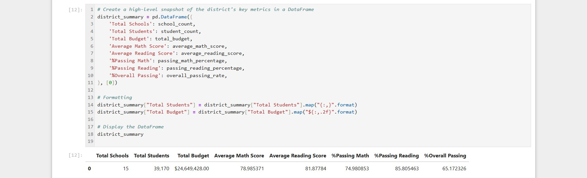

# Pandas Analysis

## Website: 
[website](https://github.com/Serg488/Pandas-Analysis)

## Description
You do the work of a Chief Data Scientist and analyze the school data of a district.

## Table of Contents
- [Installation](#installation)
- [Usage](#usage)
- [Credits](#credits)
- [License](#license)
- [Features](#features)

- [Contact](#contact)

## Installation
Pandas, Python

## Usage
Run the jupyter notebook file.

## Credits
Sergio Ramirez

## License
MIT

## Features
It provides District and schools summary.

## Contact
If there are any questions of concerns, I can be reached at:
##### [github: Serg488](https://github.com/Serg488)
##### [email: sergioramirez5555@gmail.com](mailto:sergioramirez5555@gmail.com)
